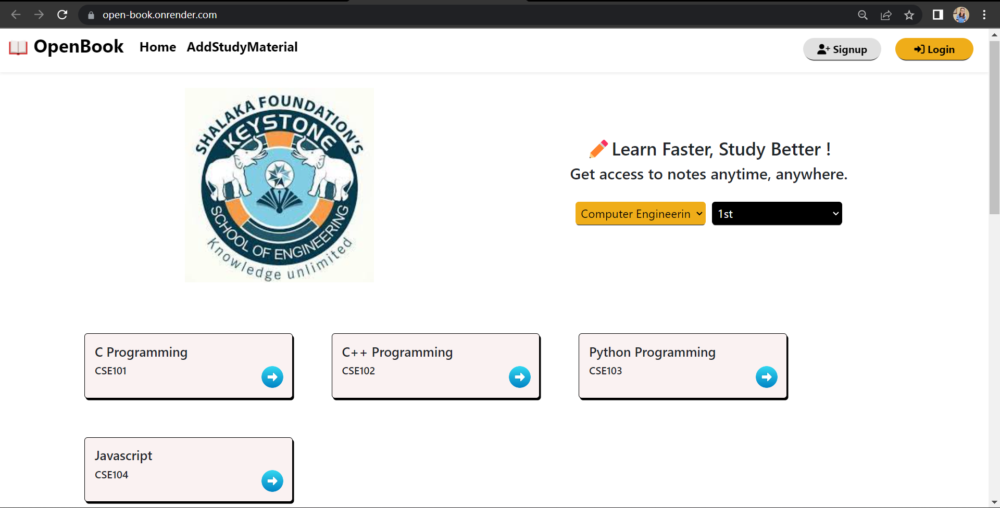
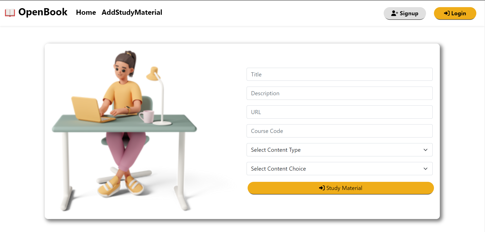
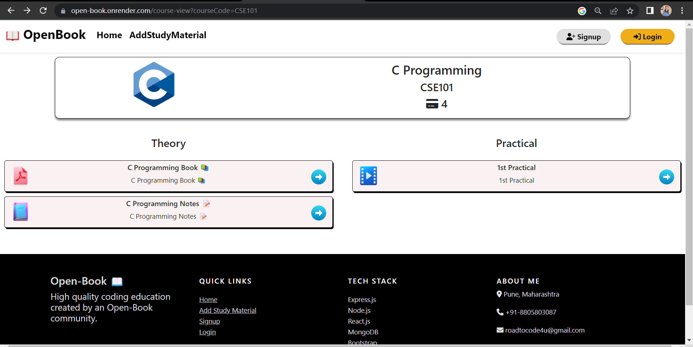
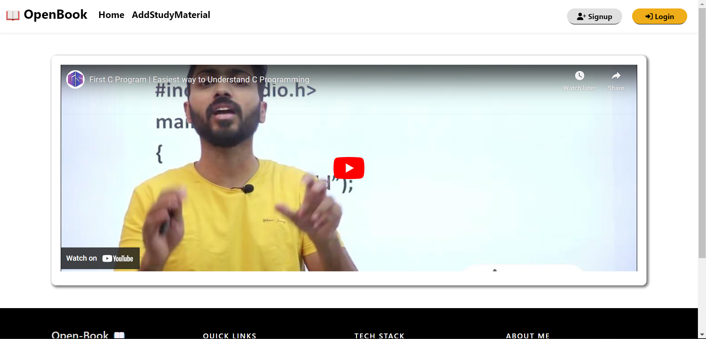

# OpenBook 📖

## ✏️Learn Faster, Study Better !

**Homepage**

**Add StudyMaterial**

**StudyMaterial**

**Use Of Project**

This is Open Book Project I developed this project because my college student can see all the notes and reading material in one place instead of searching for them in a WhatsApp group.

**Description**

I developed this project using the **MERN** Stack.

In this project, we can add study material **Branch-wise** and **Subject-wise**. Anyone can access notes **anytime, anywhere**. Other students also view those study materials free of cost. Only **Admin** (teachers) who have admin access only they can add the study materials but everyone can view the study materials in one place.

**Real Life Use:**

I Share this project with my HOD and he was very impressed he implemented this project in our college and currently my college is using this application.

**Future scope:**

In the future I want to make this application scalable so that we can implement this in other colleges I don't want to restrict this application to only my college.

[!JSON FILE](https://github.com/roadtocode4u/openbook/blob/main/client/src/utils/subjectMaps.json) When editing this JSON file, please add subjects organized by semester.

